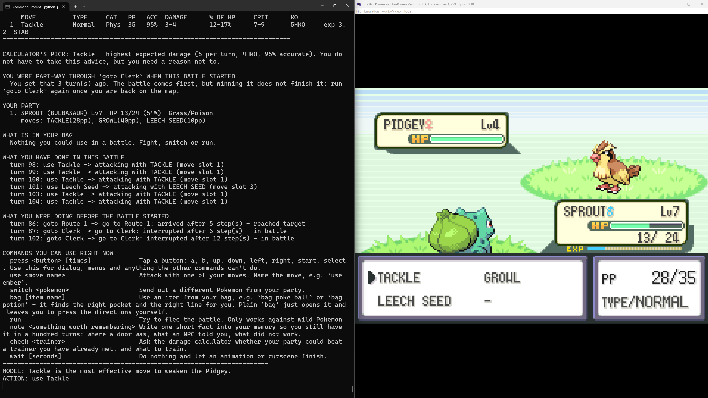

# AI Plays Pokemon



2026 has become the year of AI agents, with people publishing guides for controlling everything from sprinkler systems to crypto wallets with agentic models.  However, these guides tend to gloss over why and how you should build your tooling and harnesses, and instead recommend making everything an MCP server and to just throw data at increasingly more expensive models until you find one that works.  This solution works, but leads to two bad habits: everyone uses expensive cloud models to solve everything, and everyone removes all their privacy by exposing all of their personal data directly to these remote models.  It’s also not sustainable; no one wants to pay money every time they look at a light switch or read an email.  

We in the AI Village would like to provide a better example in this space, showing off both the logic of why and what to expose to a model, as well as how different harness and tooling designs can allow local edge models to work at the same level as frontier cloud platforms.  To do this, we decided to use the classic video games of Pokemon Fire Red and Leaf Green.  Both because it is a simple game that everyone can understand, and the author of this repo is a massive fan of the series.  

### Installation

To properly run this project, you will need a couple additional software packages to be downloaded first:
- [Ollama](https://ollama.com/): This is what we use to download and manage the models locally on the laptop/desktop/Raspberry Pi/etc
- [mGBA](https://mgba.io/downloads.html): This is the Game Boy Advance emulator we use to run the Pokemon ROM
- A copy of a Pokemon Fire Red or Leaf Green ROM.  For my demos, I have been using Pokemon - Leaf Green Version (U) (V1.1)

The main script to have the LLM play the game is [player_ai](./player_ai.py).  To install all the requirements needed for it, from the main folder in this repo run: 

```bash 
pip install -r requirements.txt
```

### Running the Project

To run the project, you need to do several things:

- First make sure Ollama is running on the local machine
- Start mGBA, and load the Pokemon Fire Red or Leaf Green ROM
- Within mGBA, click the `Tools` menu and then the `Scripting...` menu
  - Within the `Scripting` pop up window, click `File` and `Load Script...`
    - Within the file dialog window, navigate to the [mgba_server.lua](./mGBA/mgba_server.lua) lua script and select it.  It is located in the mGBA folder
    - Click `Run`, You should now see some text in the window saying the lua server is loaded.  
- Within a terminal window, run `python player_ai.py`
  - The AI should now be trying to play the game


## Background

Pokemon actually has a long, if unintentional, history in the programming space.  While MissingNo was a glitch, it’s a great lesson in memory management.  And Twitch Plays Pokemon exposed millions of people to just how powerful and silly APIs can get.  Last year, both Anthropic and OpenAI even used the games as an informal benchmark, doing live streams with both of their models successfully completing the game.  Thus, there’s not only a lot of history in this space, but even a good comparison to grade ourselves against.  

## The Challenge and Set Up

Our goal is to defeat the Elite Four and become the Pokemon Champion in either Fire Red or Leaf Green using only locally hosted models and tools.  The goal is to see both how far we get and if we can do better than Anthropic and OpenAI.  

- We’ll be using Ollama as our LLM hosting environment, since it’s pretty easy to set up across multiple operating systems   
- Gemma4 will be the family of models we’ll use, but all the tools should be model-agnostic
  - We picked Gemma 4 because it has a wide selection of sizes for local models that can run on both Raspberry Pis and laptops 
- The model must be involved in playing the game
  - While this is a TAS, we don’t want everything to be hard-coded
- When possible, try to mimic and keep only the data avaliable that a human player would have

## Tool Design

To beat Fire Red and Leaf Green, we need the model to know how to do three things: navigate around the map, manage its party, and how to battle.  Passing random screenshots and asking a local model what to do next is both incredibly slow and unlikely to result in anything other than the model just walking around in a circle, as the constant actions overwhelm its memory and the lack of optimization will tempt the model into doing only a single key press per cycle.    So to actually go anywhere, we’re going to have to write some software to help the LLM out.  

But before we get into our actual solutions, let's go over how you decide what needs to be a tool for a model, and how you should present data to a model.  A key point is that tools allow agents and models to interact with an existing system or data set; it doesn’t mean that the model or agent becomes that system or data set.  Your tooling acts as a translator between the discrete deterministic space of the existing program and the nondeterministic space of the model/agent.  This both lets you keep the repeatability and reliability of the underlying tool program, and separates the model and agent from the logic within the tool.  

A good example of this is navigation.  Let's say you have a drone, and you are using an agent to interface with and control the drone.  Telling the drone to go from X to Y or to travel Z distance in a direction are pretty common asks; however, the math for geospatial navigation can get very complicated very fast, especially when changing altitude or moving over long distances.  While you could have the agent solve the math internally, doing so doesn’t give you a guarantee that it will always solve it the same way, and that it won’t try to simplify the solution in a way that makes the answer incorrect.  Thus, separating these calculations into a standalone tool that the agent/model calls via API and then passes in the locations and distances from the user while getting back a validated answer.  You can even move the actual waypoint calls inside this script, making it so that your model/agent is only getting a more abstracted and easier-to-understand description of what is going on rather than the underlying MAVLink message traffic.  

### Navigation

Because we are going to be running on an emulator, we actually have multiple ways to solve navigating across the map.  The game itself keeps track of the player location as well as those of the NPCs, so we could just grab and expose those values.  However, that approach isn't really adaptable to other games, both other pokemon games and other Game Boy Advance releases.  Instead, we'll use tile matching for location finding, and then dynamically calculate the route from there.  

Tile matching takes advantage of how every map in the early generations of Pokemon were made out of a combination of 16x16 pixel tiles.  Additionally, each map is unique enough that you can almost always tell which map you are on.  This means that you can compare a live screenshot of the game to the extracted map images, and pretty reliably know exactly where you are.  This tile pattern also makes it dynamically figure out routes and paths, since you can label which tiles are walkable/surfable/etc and which are not.  We have a full breakdown of how navigation works over in [location tracking](./locationTracking/README.md).  

### Battles

Battles are another great example of a problem easily solved with tooling.  From a data standpoint, the Generation III pokemon games are in a weird spot, since you cannot use the current and most common type chart, because we don't have the fairy type yet, and Pokemon moves are classified as Special or Physical purely based on their typing.  This means that if you ask most models directly a battle related question, they will likely get it wrong, since they will give an answer that is true for the newer games, but not ours.  At the same time, the type chart, move list, and Pokemon typing are all static, and will stay the same no matter how many times the game is played, thus it makes since to externalize these as a calculator function the model can call and trust on. The full details of this is over in the [battle folder](./battle/README.md).   

