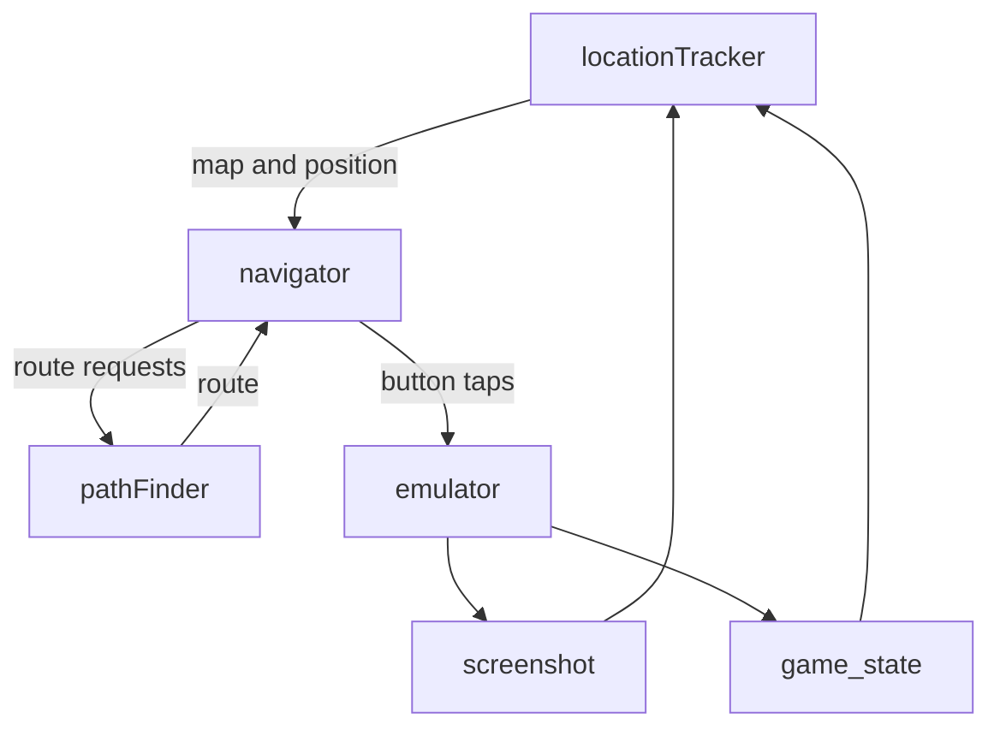

# Location Tracking in Pokemon

This is a set of tools and data sets to help automatically identify where the player character is in Pokemon Fire Red and Leaf Green.  

Originally the goal of this toolset was to try and mimic as much as possible how a human would identify where they were when playing the game.  This is why there are so many map screenshots, because a very quick version of this is to take a screenshot of the game and use tile matching to figure out where the player character is on the map.  Additionally, because of how unique each overworld map is, this also lets you figure out what map you are on in addition to where you are on it.  

However, tile matching by itself quickly runs into problems.  While the overwold sections of the game are all fairly unique in layout, many of the interriors of buildings all use the exact same map, only changing in NPC layout.  However, since most NPCs move around when in frame, it's very hard to add them to the map and use them as landmarks or identifiers.  As such, we fall back on pulling the game state from the emulator and reading which map we are on from that.  

Both tile matching and reading the game state gives us a map ID and relative location.  Using that info, we then figure out what we are nearby and what things we can get to within [the pathfinder](./pathfinder.py).  The pathing is based on the tile data we grabbed when labeling each tile of each map as walkable or not, and other special charactistics it might have had.  

## Pipeline



If it seems confusing, it's because it is.  As the goal of the project grew from just playing the first part of the game, to beating the entire thing, navigation went from just walking from Pallet Town to Pewter City to have to handle spaces blocked via HM moves, switches, items, etc.  

## Tools

| File | What it does |
| --- | --- |
| `mapEditor.py` | **The one editor.** Tile classification, map connections (with a click-to-pick Target Picker so you never type coordinates), item/object tagging (objects get a category), and a wild-encounter review panel — all in one window with mode toggles. Replaces the old `tileClassifier.py` + `connectionEditor.py`. |
| `locationTracker.py` | Template-matches a screenshot to a map + tile. Searches the current map and its connection neighbors first (fast), full-scans only on low confidence. Uses `GAME_STATE`'s `map_bank`/`map_number` to disambiguate shared interiors. |
| `pathfinder.py` | Multi-map A* plus semantic routing: `planToLandmark`, `planToObjectCategory` (nearest Pokemon Center, ...), `planToItem`, `planToCatch` (nearest tile where a species can be met). Handles object *approach* (stand adjacent + face), HM/badge-gated obstacles, and `@return` exits via a warp stack. |
| `navigator.py` | The LLM-facing closed loop: `goTo` / `goHeal` / `goCatch` / `collect`. Takes one step, re-observes, and replans on drift; reports battles/dialog as interruptions. `goCatch` also paces the encounter terrain once it arrives. |
| `encounterExtractor.py` | Reads wild-encounter tables straight from the ROM into `encounterData/<game>/romEncounters.json`, keyed by `(bank,number)`. This is the primary source of encounter data — the pathfinder reads it directly. |
| `romVersion.py` | Decides whether we are playing FireRed or LeafGreen, and where that answer came from. The only thing that differs between the two games here is the encounter tables — see [Which game](#which-game-firered-vs-leafgreen). |
| `validate.py` | Reports dataset problems: dangling connections, missing instances, unclassified tiles, maps whose encounters have no tile to trigger them, objects without a category. |
| `autoClassifier.py` | First-pass automatic tile classification by color/heuristics; refine in `mapEditor.py`. |

### Editor usage

```
python mapEditor.py                       # file picker
python mapEditor.py maps/PalletTown.png   # one map
python mapEditor.py --batch maps          # iterate the whole folder (n / p to page)
```

Modes (toolbar): **Tiles**, **Connections**, **Encounters**. `Ctrl+S` saves both
the per-map tile JSON and `connectionData/connections.json`.

## Which game: FireRed vs LeafGreen

The two games share their maps, tiles, connections and landmarks exactly. They
differ in one dataset here — the wild-encounter tables — and they differ a lot:
**88 of the 124 tables**, including the version exclusives (FireRed has Ekans,
Oddish, Psyduck, Growlithe, Scyther; LeafGreen has Sandshrew, Vulpix,
Bellsprout, Slowpoke, Staryu, Pinsir).

Reading the wrong game's tables never throws. `catch pikachu` still plans a
route — it just walks to grass the species does not live in, and calls the
species that *do* live there uncatchable. So the dump is stored per game:

```
encounterData/firered/romEncounters.json
encounterData/leafgreen/romEncounters.json
```

`romVersion.py` picks between them. First hit wins:

1. an explicit argument — `Pathfinder(version="firered")`
2. **the running emulator** — `GAME_STATE` reports `game` as `"FireRed v1.1"`,
   which `navigator.py` reads and passes down. This is the normal path, and it
   needs no configuration: point mGBA at a ROM and the right tables load.
3. `$POKEMON_VERSION`, for the offline tools that have no emulator to ask
   (`validate.py`, `mapEditor.py`)
4. the only version folder present, if there is just one
5. `romVersion.DEFAULT_VERSION`

Every one of those is *announced*, never assumed — the Pathfinder's startup
line ends with `[firered: requested (FireRed v1.1)]`, `validate.py` prints
which game it checked against, and `mapEditor.py` puts it in the title bar.
That is deliberate: a silent wrong choice here costs an evening.

To add or refresh a game's tables, point the extractor at that ROM. It files
the dump by the ROM's own header, so it cannot land in the wrong folder:

```
python encounterExtractor.py ~/ROMS/PokemonFireRed.gba
# ROM BPRE v1 (firered)  wildAddr=0x083C9D28
# Dumped 124 map encounter tables to encounterData/firered/romEncounters.json
```

## Wild encounters

The game keys its encounter tables by `map_bank`/`map_number`, so a table belongs
to a **map**, not to a patch of grass. Map files are named `bank-number-Name`, so
a map's table is looked up in `encounterData/<game>/romEncounters.json` with no
per-map tagging at all — there is nothing to mark in the editor.

Where on the map an encounter can fire is derived from the painted grid:

* **grass** — the map's `tall_grass` tiles if it has any, otherwise its plain
  `walkable` floor. That second branch is what makes caves work: cave floor is
  "grass" to the encounter tables but is never painted as such.
* **water** — the map's `water` tiles (needs `surf`).
* Tiles with no mutually reachable neighbour of the same kind are dropped. A
  reroll steps back and forth, so a lone tile is useless — and requiring the
  partner to be encounter terrain too keeps a reroll beside a ledge from hopping
  down it.

`fishing` and `rocksmash` are not routable yet (they need an item/interaction the
navigator doesn't model); species reachable only that way are still indexed so
`planToCatch` can say why it can't get them.

Because the tiles are derived, an unpainted map yields none — run `validate.py`
for the list of maps still needing paint. Set `encounters` in a map's tileData
JSON to override the ROM table (the editor's Encounters panel writes it).

## Data formats

* `tileData/<mapName>.json` — `tiles[row][col]` type grid, plus `items` /
  `objects` / `objectCategories` (keyed `"row,col"`, legacy) and an optional
  `encounters` override list.
* `connectionData/connections.json` — per-map `connections`, global `landmarks`,
  and an `instances` registry. A door/warp into a shared interior carries an
  `instance` id; the interior's exit uses the dynamic target `@return`, resolved
  at runtime against the warp stack.

**Coordinate convention:** the tile grid is `tiles[row][col]`; all coordinate
*points* are `[col, row]` (matching the pathfinder). The `items`/`objects` dict
keys remain `"row,col"` for backward compatibility with existing data.

## Resources

The maps for every location in the game are in the [maps folder](./maps/). 

The inspriration for this project came from looking at all the map data on [vgmaps.com](https://www.vgmaps.com/atlas/GBA/index.htm), which was a huge help. They have maps for tons of different games, so if you want to do something similar for another franchise, check them out.

I did eventually have to move from using their maps to grabing the map data directly from a decompiled version of fire red and leaf green hosted by [pret](https://github.com/pret/pokefirered).  This was very helpful for the indoor maps, because it let me grab the ingame background and borders too, which allowed all of the reference maps to be larger than the ingame screenshots.  
